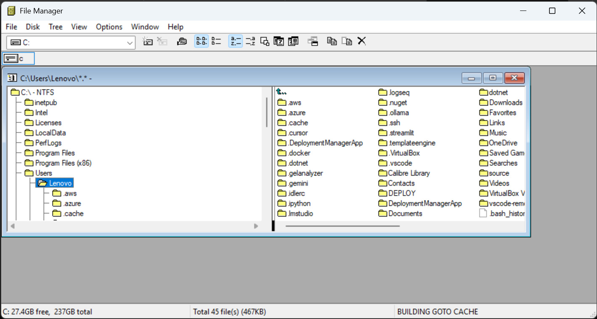

Let's discover forgotten corners on Windows 11. Elements that have been there for decades.

[State of the Windows: How many layers of UI inconsistencies are in Windows 11?](https://ntdotdev.wordpress.com/2023/01/01/state-of-the-windows-how-many-layers-of-ui-inconsistencies-are-in-windows-11/)

And, WinFile manager from Windows 3.0 was opensourced so years ago. You can install it using
```powershell
winget install microsoft.winfile --source winget
```


And why aren't these old apps "simply" modernized? Even WinFile was sunset after some time.
See what Microsoft [wrote](https://github.com/microsoft/winfile) about it:
*we simply do not have the expertise or resources within the organization to continue to maintain this project*